# 🔐 ISC Secured Chat - Encrypted Messaging Client

*A secure chat client implementing multiple cryptographic systems with Qt interface.*  
*Working Specifically with HEI Valais server made for this class*

## 🚀 Features

| Feature                | Client Command Example            | Client-Server Command Example        | Description                          |
|------------------------|---------------------------|--------------------------------------|--------------------------------------|
| Shift Cipher           | `/shift "msg" "3"`        | `/server task shift encode 3` | Encrypts with Caesar shift (+3) |
| Vigenère Cipher        | `/vigenere "msg" "KEY"`   | `/server task vigenere encode x` | Encrypts with alphabetical key |
| RSA Encryption         | `/rsa "msg" "n" "e"`      | `/server task RSA encode x` | Asymmetric encryption |
| Diffie-Hellman Exchange| `/difhel`                 | `/server task DifHel` | Key exchange protocol |
| SHA-256 Hashing        | `/hash "msg"`             | `/server task hash hash` | Cryptographic hashing |

## 📦 Installation

1. **Clone the repository**:
   ```bash
   git clone https://github.com/Dyumes/Crypto.git
   cd Crypto
   ```

2. **Install dependencies**:
   ```bash
   pip install PyQt6 sympy
   ```

3. **Server configuration** (optional):
   ```python
   # In connection.py
   SERVER_ADDRESS = "your.server.com"
   SERVER_PORT = 6000
   ```

## 🖥️ Usage

```bash
python main.py
```

### Available Commands:
```python
# Client-server commands
# Message received from server and encryption done automatically by encryption.py algorithm
# and sent to the server for verification
/server task shift encode x,     # 0 < x < 10000
/server task vigenere encode x,  # 0 < x < 10000
/server task RSA encode x,       # 0 < x < 10000
/server task hash hash

# For hash verification
/server task hash verify -> /hash verify "original_message" "hashed_message" #return true or false

# Client commands
/shift "Hello" "5"
/vigenere "Secret" "KEY"
/rsa "Data" "3233" "17"

# Key exchange
# 1 : ask server for Diffie-Hellman
/server task DifHel
# 2 : Generate DH paramaters
/difhel
# 3 :  Compute shared secret
/difhel "p" "g" "gB"  
```

## 🛠️ Technical Architecture

```mermaid
graph TD
    A[Client] -->|TCP Socket| B(Server)
    A --> C{HTMLManager}
    C --> D[QWebEngineView]
    C --> E[Message Queue]
    A --> F[Encryption]
    F --> G[Shift/RSA/Vigenère]
    F --> H[Diffie-Hellman]
    F --> I[SHA-256]
    G --> B
    H --> B
    I --> B
```


*Developed for ISC Cryptography & Security course - HEI Valais*
